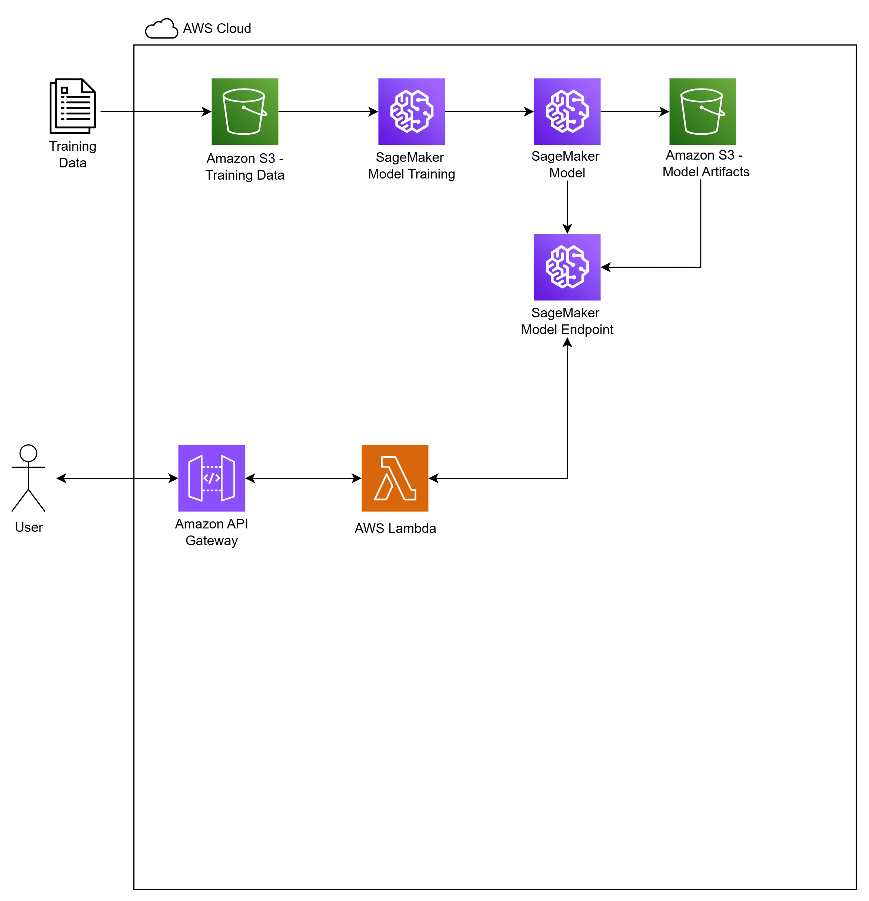

# fake-food-review-detector
An AI-powered browser extension to detect fake reviews on Google Maps. Built for the the Great AI Hackathon 2025.

# FoodTrust - Fake Food Review AI Detector

**Team Penguining** | AWS Hackathon 2024 | Student Track

## 🤔 Problem Statement:

The core problem is the **unreliability of online food reviews**. Platforms like Google Maps are saturated with **fake, bot-written, and promotional feedback**, making it nearly impossible for consumers to distinguish genuine experiences from fabricated ones. This erosion of trust not only leads to **disappointing dining choices** but also unfairly penalizes honest restaurants.

## 💡 Our Solution: 

We made an AI browser extension that brings transparency back to online reviews. It integrates with Google Maps to provide users with a real-time **"Authenticity Score"** for any restaurant's reviews, powered by a sophisticated AWS-backed AI engine.

## ✨ Key Features

*   **Real-Time Analysis:** Instantly analyzes reviews on any Google Maps restaurant page.
*   **Advanced AI Detection:** Leverages Amazon SageMaker to detect fake reviews based on linguistic patterns, sentiment analysis, and behavioral cues.
*   **Simple & Intuitive UI:** Displays a clear, color-coded authenticity score (e.g., **"85% Authentic"**) directly on the page.
*   **Scalable AWS Backend:** Built on a serverless architecture using AWS Lambda and API Gateway for reliable and cost-effective performance.
*   **📊 Data-Driven:** Trained on a custom-built dataset of real and AI-generated fake reviews for high accuracy.

## 🛠️ Technology Stack

*   **Frontend (Extension):** JavaScript, HTML, CSS
*   **Backend & AI:** Python, **Amazon SageMaker**, **AWS Lambda**, **Amazon API Gateway**
*   **Storage & Data:** **Amazon S3**
*   **Infrastructure:** AWS CloudFormation / CDK (Infrastructure as Code)
*   **Development:** Amazon SageMaker Studio Notebooks
